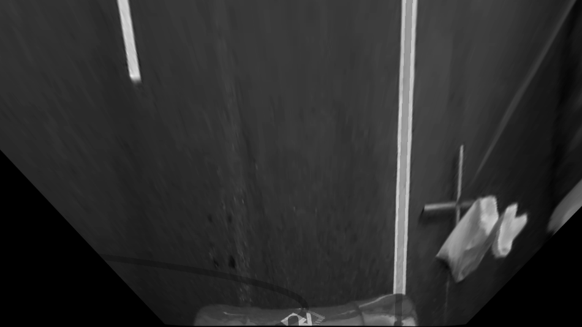
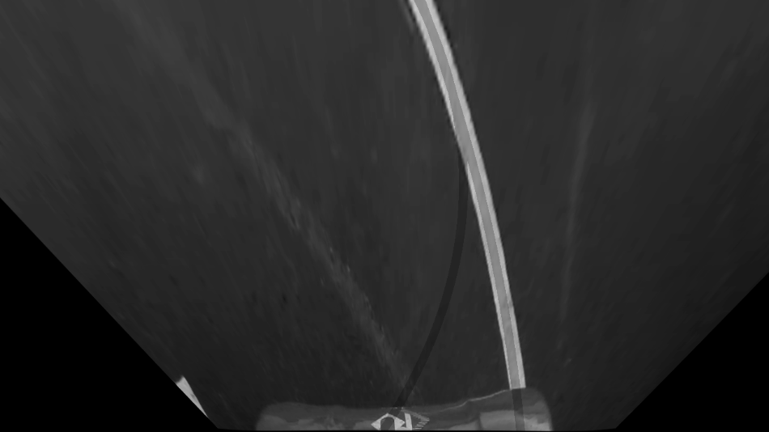

# Lane-Detect
My project for Teknofest Autonomous Taxi competition 2024 with the team IKU-Asimov.

I initially used Google Collab to write this code. You can reach that code here: https://colab.research.google.com/drive/1mVd6w7T0-bwkjXf7CXUuGbDKKIp2vwCp?usp=sharing

See this link for the video: https://drive.google.com/file/d/1v84yvYlFoX2NNgreq4MEvYnPJkxO_fZe/view?usp=sharing

File paths are of my own Google Drive. Relevant pickle files and video can be found in this repo or use your own material. You might have to make tweaks if you decide to use your own video.

You can see the tracks we are working with here  


## Some outputs:  
Output of the road, grayscale with the polynomials on  
   
Output of the road, with trailing boxes and the polynomials  
  

## Notes:

1. You may want to tweak these two variables before running your video through the code as this will determine how your image will be "birdviewed". You will see a note at the very bottom of my code that might help you get good source-destination values without running the whole video through the code.  
   ```
    source = np.float32([[1000,450],[1000, 720],[75,720],[200, 450]])
    destination = np.float32([[img_size[0], 0],
      [img_size[0]-offset, img_size[1]], [offset, img_size[1]],[0, 0]])
   ```  
2. We use a mixture of our new input and the previous ploynomial to determine the final polynomial. This weight can be tweaked.  
   ```
    weight = 0.7

     try:
       new_left_poly = np.polyfit(lefty, leftx, deg=2)
       if prev_left_poly is not None:
         leftPoly = weight * new_left_poly + (1 - weight) * prev_left_poly
       else:
         leftPoly = new_left_poly
     except TypeError as e:
       print(f"Polynomial fitting result is empty(LEFT), using previous valid polynomials")
       leftPoly = prev_left_poly
   ```


## Issues:  
  
1. When the algorithm can't find a big chunk of the road from the bottom of the screen towards the top, it will start taking in anythi it can find (eg. the logo on our car) as a road input and totally miss the part of the lane that is present. This issue can be temporarily eliminated if such obstacles are removed such as removing the logo of masking out that part of the video but this issue will reoccur on a more difficult terrain.   

Output of the road, grayscale with the polynomials on    
    
Output of the road, with trailing boxes and the polynomials    
    


2. While the program can detect turns and even their curve, it will merge both the lines together since at least one of them not be visible:
Output of the road, grayscale with the polynomials on  
  
Output of the road, with trailing boxes and the polynomials  
  

## Possible Improvements:
1. Using only one previous polynomial can cause our algorithm be confused much more quickly. If we use multiple previous polynomials, we can reduce the amount of deviation from our target.
